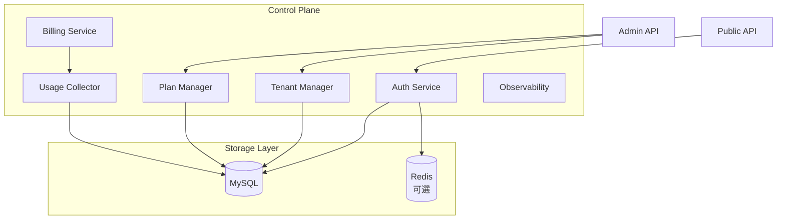
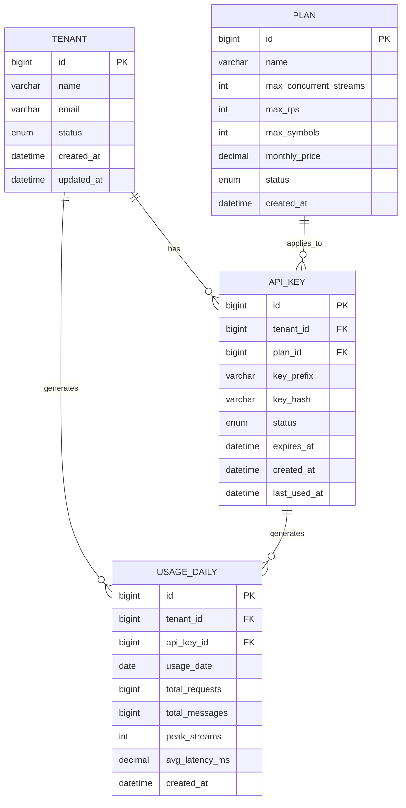
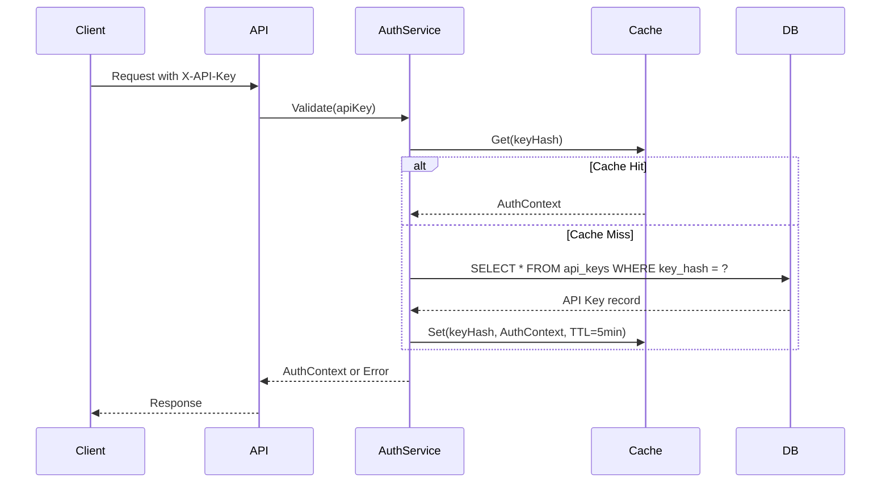
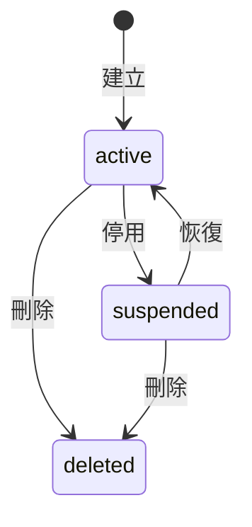
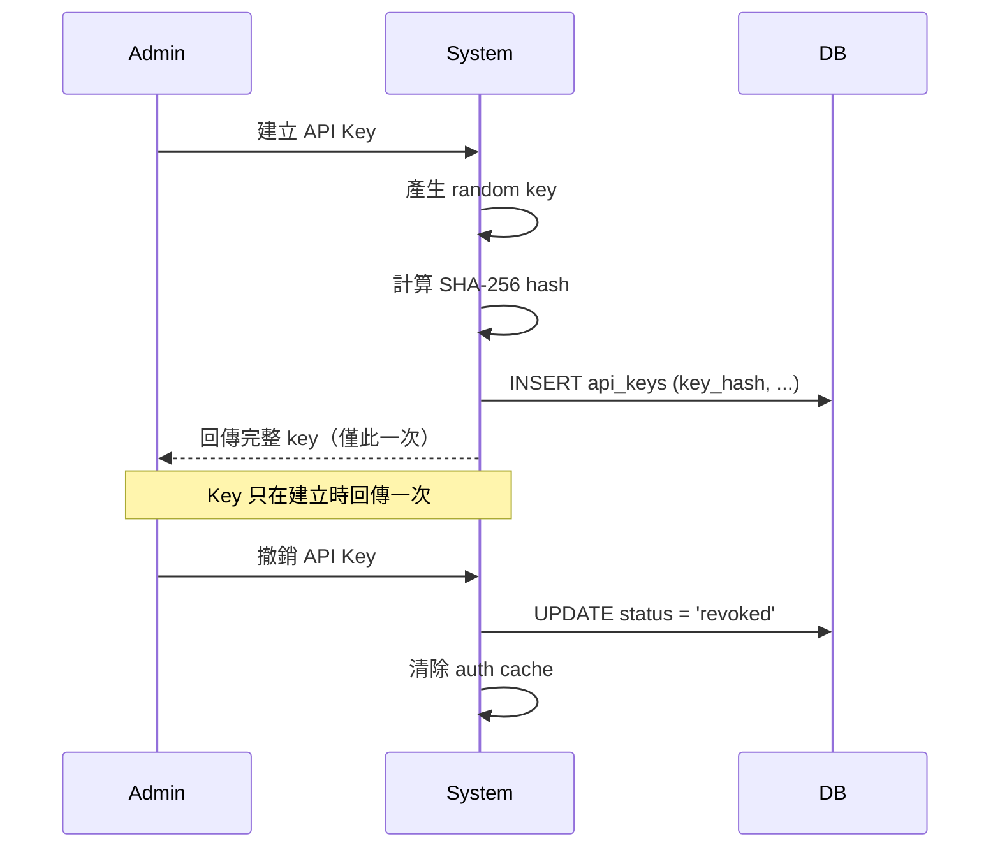
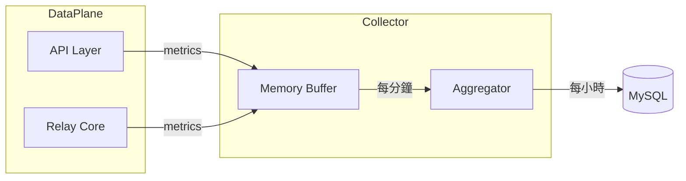

# Control Plane 設計文件

> 本文件為 [HL Relay Architecture](./hl-relay-architecture.md) 的子設計文件，
> 專注於 **Control Plane** 的詳細設計，包含 Tenant / API Key 模型與資料庫設計。

---

## 1. 概述

Control Plane 負責：

1. 多租戶（Tenant）管理
2. API Key 認證與授權
3. 方案（Plan）與配額管理
4. 使用量統計與計費
5. 可觀測性（Metrics & Logging）

---

## 2. 模組架構圖



---

## 3. 資料模型設計（MySQL Schema）

### 3.1 ER Diagram



### 3.2 DDL（MySQL）

```sql
-- 租戶表
CREATE TABLE tenants (
    id BIGINT UNSIGNED AUTO_INCREMENT PRIMARY KEY,
    name VARCHAR(255) NOT NULL,
    email VARCHAR(255) NOT NULL UNIQUE,
    status ENUM('active', 'suspended', 'deleted') NOT NULL DEFAULT 'active',
    metadata JSON,
    created_at DATETIME NOT NULL DEFAULT CURRENT_TIMESTAMP,
    updated_at DATETIME NOT NULL DEFAULT CURRENT_TIMESTAMP ON UPDATE CURRENT_TIMESTAMP,
    
    INDEX idx_status (status),
    INDEX idx_email (email)
) ENGINE=InnoDB DEFAULT CHARSET=utf8mb4;

-- 方案表
CREATE TABLE plans (
    id BIGINT UNSIGNED AUTO_INCREMENT PRIMARY KEY,
    name VARCHAR(100) NOT NULL UNIQUE,
    description TEXT,
    max_concurrent_streams INT UNSIGNED NOT NULL DEFAULT 10,
    max_rps INT UNSIGNED NOT NULL DEFAULT 100,
    max_symbols INT UNSIGNED NOT NULL DEFAULT 50,
    max_daily_requests BIGINT UNSIGNED,  -- NULL = 無限制
    monthly_price DECIMAL(10, 2) NOT NULL DEFAULT 0.00,
    status ENUM('active', 'deprecated') NOT NULL DEFAULT 'active',
    created_at DATETIME NOT NULL DEFAULT CURRENT_TIMESTAMP,
    
    INDEX idx_status (status)
) ENGINE=InnoDB DEFAULT CHARSET=utf8mb4;

-- API Key 表
CREATE TABLE api_keys (
    id BIGINT UNSIGNED AUTO_INCREMENT PRIMARY KEY,
    tenant_id BIGINT UNSIGNED NOT NULL,
    plan_id BIGINT UNSIGNED NOT NULL,
    key_prefix VARCHAR(8) NOT NULL,      -- 前 8 字元，用於識別
    key_hash VARCHAR(64) NOT NULL,       -- SHA-256 hash
    name VARCHAR(100),                   -- 使用者自訂名稱
    status ENUM('active', 'revoked', 'expired') NOT NULL DEFAULT 'active',
    permissions JSON,                    -- 可選：細粒度權限
    expires_at DATETIME,                 -- NULL = 永不過期
    created_at DATETIME NOT NULL DEFAULT CURRENT_TIMESTAMP,
    last_used_at DATETIME,
    
    FOREIGN KEY (tenant_id) REFERENCES tenants(id),
    FOREIGN KEY (plan_id) REFERENCES plans(id),
    UNIQUE INDEX idx_key_hash (key_hash),
    INDEX idx_tenant_status (tenant_id, status),
    INDEX idx_prefix (key_prefix)
) ENGINE=InnoDB DEFAULT CHARSET=utf8mb4;

-- 每日使用量統計表
CREATE TABLE usage_daily (
    id BIGINT UNSIGNED AUTO_INCREMENT PRIMARY KEY,
    tenant_id BIGINT UNSIGNED NOT NULL,
    api_key_id BIGINT UNSIGNED NOT NULL,
    usage_date DATE NOT NULL,
    total_requests BIGINT UNSIGNED NOT NULL DEFAULT 0,
    total_messages BIGINT UNSIGNED NOT NULL DEFAULT 0,
    peak_concurrent_streams INT UNSIGNED NOT NULL DEFAULT 0,
    avg_latency_ms DECIMAL(10, 2),
    error_count BIGINT UNSIGNED NOT NULL DEFAULT 0,
    created_at DATETIME NOT NULL DEFAULT CURRENT_TIMESTAMP,
    updated_at DATETIME NOT NULL DEFAULT CURRENT_TIMESTAMP ON UPDATE CURRENT_TIMESTAMP,
    
    FOREIGN KEY (tenant_id) REFERENCES tenants(id),
    FOREIGN KEY (api_key_id) REFERENCES api_keys(id),
    UNIQUE INDEX idx_key_date (api_key_id, usage_date),
    INDEX idx_tenant_date (tenant_id, usage_date)
) ENGINE=InnoDB DEFAULT CHARSET=utf8mb4;

-- 審計日誌表（可選）
CREATE TABLE audit_logs (
    id BIGINT UNSIGNED AUTO_INCREMENT PRIMARY KEY,
    tenant_id BIGINT UNSIGNED,
    api_key_id BIGINT UNSIGNED,
    action VARCHAR(50) NOT NULL,
    resource_type VARCHAR(50),
    resource_id VARCHAR(100),
    details JSON,
    ip_address VARCHAR(45),
    user_agent VARCHAR(500),
    created_at DATETIME NOT NULL DEFAULT CURRENT_TIMESTAMP,
    
    INDEX idx_tenant (tenant_id),
    INDEX idx_action_time (action, created_at),
    INDEX idx_created_at (created_at)
) ENGINE=InnoDB DEFAULT CHARSET=utf8mb4;
```

### 3.3 預設資料

```sql
-- 預設方案
INSERT INTO plans (name, description, max_concurrent_streams, max_rps, max_symbols, monthly_price) VALUES
('free', '免費方案，適合開發測試', 5, 10, 10, 0.00),
('pro', '專業方案，適合小型團隊', 50, 100, 50, 99.00),
('enterprise', '企業方案，無限制使用', 500, 1000, 200, 499.00);
```

---

## 4. Auth Service 詳細設計

### 4.1 職責

* 驗證 API Key
* 查詢對應的 tenant 與 plan
* 快取認證結果以減少 DB 查詢

### 4.2 API Key 格式

格式：`hl_<random_32_chars>`

範例：`hl_a1b2c3d4e5f6g7h8i9j0k1l2m3n4o5p6`

* 前綴 `hl_` 用於識別
* 後 32 字元為隨機生成
* 儲存時只保留 hash（SHA-256）

### 4.3 認證流程



### 4.4 AuthContext 結構

```
AuthContext {
    TenantID: int64
    TenantName: string
    TenantStatus: string
    APIKeyID: int64
    APIKeyStatus: string
    PlanID: int64
    PlanName: string
    
    // 配額限制
    MaxConcurrentStreams: int
    MaxRPS: int
    MaxSymbols: int
    MaxDailyRequests: int64  // 0 = 無限制
    
    // 權限（可選）
    Permissions: []string
    
    // 時間戳
    ExpiresAt: time
    CachedAt: time
}
```

### 4.5 快取策略

* **快取 Key**：`auth:{key_hash}`
* **TTL**：5 分鐘（可配置）
* **失效策略**：
  * API Key 被撤銷時主動清除
  * 過期後自動失效
* **實現**：可使用 Redis 或 in-memory cache

---

## 5. Tenant Manager 詳細設計

### 5.1 職責

* CRUD 租戶資料
* 管理租戶狀態
* 提供管理介面

### 5.2 Tenant 狀態機



### 5.3 Admin API（概念）

| 操作 | 方法 | 路徑 | 說明 |
|------|------|------|------|
| 建立租戶 | POST | /admin/tenants | 建立新租戶 |
| 查詢租戶 | GET | /admin/tenants/{id} | 取得租戶詳情 |
| 列出租戶 | GET | /admin/tenants | 分頁列出所有租戶 |
| 更新租戶 | PUT | /admin/tenants/{id} | 更新租戶資料 |
| 停用租戶 | POST | /admin/tenants/{id}/suspend | 停用租戶 |
| 刪除租戶 | DELETE | /admin/tenants/{id} | 軟刪除租戶 |

---

## 6. API Key Manager 詳細設計

### 6.1 職責

* 建立、撤銷 API Key
* 支援 Key rotation
* 追蹤使用情況

### 6.2 API Key 生命週期



### 6.3 Key Rotation 流程

1. 建立新 Key（同一 tenant + plan）
2. 舊 Key 保持 active，設定 grace period（如 7 天）
3. Client 切換至新 Key
4. Grace period 後撤銷舊 Key

### 6.4 Admin API（概念）

| 操作 | 方法 | 路徑 | 說明 |
|------|------|------|------|
| 建立 Key | POST | /admin/tenants/{id}/api-keys | 建立新 API Key |
| 列出 Keys | GET | /admin/tenants/{id}/api-keys | 列出租戶的所有 Key |
| 撤銷 Key | DELETE | /admin/api-keys/{id} | 撤銷指定 Key |
| 更新 Plan | PUT | /admin/api-keys/{id}/plan | 變更 Key 的方案 |

---

## 7. Usage Collector 詳細設計

### 7.1 職責

* 收集即時使用資料
* 聚合並寫入資料庫
* 提供使用量查詢

### 7.2 收集流程



### 7.3 收集的指標

| 指標 | 來源 | 聚合方式 |
|------|------|----------|
| 請求數 | API Layer | SUM |
| 訊息數 | Fanout Hub | SUM |
| 併發 Stream 數 | Fanout Hub | MAX |
| 平均延遲 | API Layer | AVG |
| 錯誤數 | 各模組 | SUM |

### 7.4 資料保留策略

| 粒度 | 保留時間 | 用途 |
|------|----------|------|
| 分鐘級 | 24 小時 | 即時監控 |
| 小時級 | 7 天 | 趨勢分析 |
| 日級 | 1 年 | 計費 & 報表 |

---

## 8. Billing Service 設計（概念）

### 8.1 計費模式

支援多種計費模式：

1. **固定月費**：按 plan 收費
2. **用量計費**：超出配額部分額外收費
3. **混合模式**：基本費 + 超額費

### 8.2 計費週期

* 計費週期：每月（自然月）
* 帳單產生：每月 1 日
* 付款期限：帳單日起 15 天

### 8.3 超額計費（範例）

| 項目 | 免費額度 | 超額單價 |
|------|----------|----------|
| API 請求 | 100萬/月 | $0.01 / 1000 requests |
| 資料傳輸 | 10GB/月 | $0.05 / GB |

---

## 9. Observability 設計

### 9.1 Metrics（Prometheus 格式）

```
# 認證相關
auth_requests_total{status="success|failed|expired"}
auth_cache_hit_total
auth_cache_miss_total
auth_latency_ms

# 租戶相關
tenant_count{status="active|suspended"}
api_key_count{status="active|revoked"}

# 使用量
usage_requests_total{tenant_id, api_key_id}
usage_active_streams{tenant_id}
usage_quota_remaining{tenant_id, quota_type}
```

### 9.2 Logging

| Log Level | 事件類型 |
|-----------|----------|
| INFO | API Key 建立、Tenant 建立 |
| WARN | 配額接近上限（>80%）、認證失敗 |
| ERROR | DB 錯誤、Cache 錯誤 |

### 9.3 Alerting 規則

| 規則 | 條件 | 嚴重度 |
|------|------|--------|
| 認證失敗率過高 | 5 分鐘內 > 10% | WARNING |
| DB 連線失敗 | 連續 3 次失敗 | CRITICAL |
| 配額耗盡 | 任一 tenant 達 100% | WARNING |

---

## 10. 安全考量

### 10.1 API Key 安全

* ✅ 只儲存 hash，不儲存明文
* ✅ 使用安全的隨機數產生器
* ✅ Key 只在建立時顯示一次
* ✅ 支援過期時間設定
* ✅ 支援 IP 白名單（可選）

### 10.2 存取控制

* Admin API 需要額外的管理員認證
* 使用 RBAC 控制管理權限
* 所有操作記錄審計日誌

### 10.3 資料保護

* 資料庫連線使用 TLS
* 敏感欄位加密儲存（如 metadata）
* 定期備份與災難復原計劃

---

## 11. 配置項目

```yaml
control_plane:
  database:
    driver: mysql
    host: localhost
    port: 3306
    database: hl_relay
    username: ${DB_USERNAME}
    password: ${DB_PASSWORD}
    max_open_conns: 100
    max_idle_conns: 10
    conn_max_lifetime: 1h
    
  cache:
    type: redis  # or "memory"
    redis:
      address: localhost:6379
      password: ${REDIS_PASSWORD}
      db: 0
    auth_ttl: 5m
    
  api_key:
    prefix: "hl_"
    length: 32
    default_ttl: 0  # 0 = 永不過期
    
  usage:
    flush_interval: 1m
    aggregation_interval: 1h
    retention:
      minute: 24h
      hourly: 7d
      daily: 365d
      
  billing:
    enabled: false
    cycle: monthly
    currency: USD
```

---

## 附錄 A：API 錯誤碼

| 錯誤碼 | HTTP Status | gRPC Status | 說明 |
|--------|-------------|-------------|------|
| AUTH_MISSING_KEY | 401 | UNAUTHENTICATED | 缺少 API Key |
| AUTH_INVALID_KEY | 401 | UNAUTHENTICATED | API Key 無效 |
| AUTH_EXPIRED_KEY | 401 | UNAUTHENTICATED | API Key 已過期 |
| AUTH_REVOKED_KEY | 401 | UNAUTHENTICATED | API Key 已撤銷 |
| AUTH_SUSPENDED_TENANT | 403 | PERMISSION_DENIED | 租戶已停用 |
| QUOTA_EXCEEDED_STREAMS | 429 | RESOURCE_EXHAUSTED | 超過併發 Stream 限制 |
| QUOTA_EXCEEDED_RPS | 429 | RESOURCE_EXHAUSTED | 超過 RPS 限制 |
| QUOTA_EXCEEDED_DAILY | 429 | RESOURCE_EXHAUSTED | 超過每日請求限制 |

---

## 附錄 B：相關文件

* [主架構文件](./hl-relay-architecture.md)
* [Relay Core 設計文件](./relay-core-design.md)
