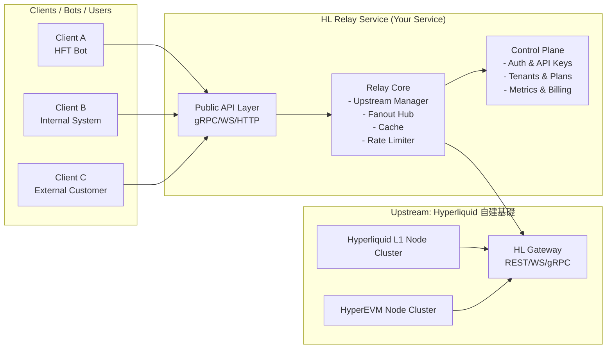

# Hyperliquid 全自建中繼服務技術設計文件 v0.1

## 0. 文件範圍（Scope）

本文件描述如何建立一個**全自建 Hyperliquid 中繼服務（HL Relay Service）**，角色類似 Dwellir，涵蓋：

1. **上游**：自建的 Hyperliquid L1 / HyperEVM 節點與 Gateway
2. **中間層**：HL Relay Service（你的服務）
3. **下游**：外部使用者（HFT bot、量化團隊、內部系統）

本文件目標：

* 幫助你設計出一個：

  * 低延遲
  * 高可用
  * 多租戶
  * 可計費 / 可觀測
    的 Hyperliquid 資料/交易中繼平台。
* 目前先以**市場資料（Market Data / Streaming）**為主；交易寫入（下單）可以先視為直連官方 Gateway 或未來才接入 Relay。

---

## 1. 系統角色與名詞定義

* **Hyperliquid L1 Node**
  執行 Hyperliquid L1 協議的 full node，負責出塊、維護訂單簿、撮合結果等。

* **HyperEVM Node**
  執行 Hyperliquid EVM 端（HyperEVM）的節點，提供標準 JSON-RPC。

* **HL Gateway（上游 Gateway）**
  部署在你節點前方的官方/自建 Gateway，提供：

  * REST API（下單 / 撤單 / 查倉位）
  * WebSocket（user stream、orderbook）
  * gRPC Streaming（L1 block / orderbook / fills 等）

* **HL Relay Service（中繼服務）**
  你設計與建置的中間層，負責：

  * 對上：少量長連線連至 HL Gateway
  * 對下：提供多租戶 API（gRPC / WS / HTTP）
  * 中間：快取、分發、限流、統計、觀測、驗證、風控。

* **Tenant / Account**
  使用你服務的客戶（或內部專案）。一個 tenant 可以有多個 API Keys。

* **API Key**
  用來識別與驗證 caller 的憑證，與 quota / plan 綁定。

---

## 2. 需求

### 2.1 功能性需求（Functional Requirements）

1. **多租戶市場資料服務**

   * 支援多個 tenant，同時訂閱多個 symbol 的 orderbook / trades / ticker 等資料。
   * 客戶透過你提供的 API，而不是直接連 Hyperliquid 官方。

2. **單一上游，多下游分發**

   * 對某一 symbol，只需維護「少量」上游 stream（理想情況 1 條）。
   * 可以 fan-out 給 N 個下游訂閱者。

3. **基本快取與 snapshot**

   * 每個 symbol 至少快取「最新 orderbook snapshot」。
   * 下游新訂閱者應先拿到 snapshot，再接住 streaming 更新。

4. **API Key 驗證與限流**

   * 每個 API Key 有：

     * 最大併發訂閱數
     * 最大請求頻率（例如每秒訂閱/取消）
   * 違規者應收到清楚錯誤（HTTP/gRPC status）。

5. **觀測與告警**

   * 需要 metrics：QPS、延遲、active streams、失敗率。
   * 出現異常（例如上游連線反覆重連）時，能觸發告警（email / Slack / PagerDuty）。

6. **多 region 支援（可選 v1 先單區）**

   * 支援在不同 region 部署（如 Tokyo / Singapore）。
   * 將來可以基於 client IP 做就近路由。

### 2.2 非功能性需求（Non-Functional Requirements）

1. **延遲**

   * Server 至 Hyperliquid Gateway 的 RTT 優先目標：< 5–10 ms（同區域部署）。
   * Server 對下游（在相同 region）：端到端延遲控制在 10–30 ms 級別。

2. **可用性**

   * 目標 service uptime ≥ 99.9%。
   * 上游節點故障時，能在數秒內轉移至備援節點。

3. **擴展性**

   * 支援至少數百個併發訂閱者、數十個 symbol，同時 streaming。
   * 垂直擴充（scale up）與水平擴充（scale out）皆可。

4. **安全性**

   * 所有對外 API 需走 TLS。
   * API Key 不以明文儲存，最好只儲 hash。
   * 防止惡意濫用（flooding / slow consumer）。

---

## 3. 高階架構與資料流

### 3.1 高階架構圖（Mermaid）

### 3.2 資料流（以 orderbook stream 為例）

1. Relay 後端啟動時，Upstream Manager 與 HL Gateway 建立 gRPC stream：
   `StreamOrderBook(symbol = "BTC-PERP")`
2. HL Gateway 持續往上游 stream 推送 orderbook 更新。
3. Relay Core 的 Fanout Hub 接到更新，更新 cache（最新 snapshot），並將此更新 broadcast 給所有訂閱該 symbol 的下游 client。
4. 若有新的 client 訂閱同一 symbol：

   * Relay 先從 cache 推出 snapshot 給他。
   * 然後將他加入該 symbol 的 subscriber list，之後收到更新就一併推送。

---

## 4. 上游：Hyperliquid 自建節點 & Gateway 設計

### 4.1 節點類型與拓樸

* **L1 Node Cluster**

  * 至少 2 台 full node（1 主 1 備）。
  * 只對內網開放，供 Gateway 讀取狀態與寫入交易。

* **HyperEVM Node Cluster**

  * 視你是否需要 EVM 查詢。
  * 假設 2 台 full node，提供 JSON-RPC（供 Gateway 或你的 internal tools 使用）。

* **HL Gateway**

  * 正式對外（對 Relay）暴露 API。
  * 支援：

    * REST：下單 / 查倉位…
    * WebSocket：user stream / orderbook
    * gRPC：L1 blocks / orderbook / fills 等 streaming。

### 4.2 基本硬體建議（單一 region）

> 粗略建議，實際要看 Hyperliquid 官方要求。

* 每台 L1 Node：

  * CPU：8 vCPU 以上
  * RAM：32–64 GB
  * Disk：NVMe SSD（至少 1 TB）
  * NIC：1 Gbps+ 網路

* Gateway：

  * CPU：4–8 vCPU
  * RAM：8–16 GB
  * 專注低延遲網路設定（關掉多餘的 background job、調整 TCP 等）

### 4.3 與 Relay 的連線模型

* Relay 對 Gateway：

  * **gRPC**：長連線 stream（orderbook / blocks / fills）
  * **REST**：偶爾查詢或輔助 api
  * **WebSocket（選擇性）**：若有 user stream 或額外 channel 需求

* 安全性：

  * Gateway endpoint 不對公網曝光，只接受特定 IP (Relay 所在機器)。
  * 使用 mTLS / API key 驗證（內網可簡化）。

---

## 5. HL Relay Service 詳細設計

Relay 是你真正的「產品核心」。可以拆成**資料平面 (Data Plane)** 和 **控制平面 (Control Plane)**。

### 5.1 Data Plane 模組

#### 5.1.1 Upstream Manager

職責：

* 與 HL Gateway 建立並維護 gRPC / WS 長連線。
* 管理每個 symbol 的上游 stream：

  * 已啟用 symbol 清單
  * stream 的生命週期（建立、斷線、重連）
* 自動 failover：

  * 若主 Gateway 不健康，切到備援 Gateway 或備援 node。

關鍵需求：

* backoff 重試策略（exponential backoff）
* 健康檢查（health probe / ping）

#### 5.1.2 Fanout Hub

職責：

* 每個 symbol 對應一個「channel / topic」。
* 當收到上游更新時，推送給所有訂閱該 symbol 的 subscriber。
* 處理 slow consumer：

  * 若 subscriber 讀取速度過慢，應斷線或丟棄並記錄。

資料結構（概念）：

* `symbol -> set of subscribers`
* subscriber 內部有：

  * 發送 channel / buffer
  * 相關 metadata（tenant / API key / connect time）

#### 5.1.3 Cache Layer

職責：

* 儲存每個 symbol 的最新 orderbook snapshot。
* 可選擇儲存最近 N 筆 trades / blocks，用於：

  * 新 client 初次連線同步
  * 做 gap 補齊。

快取策略：

* In-memory 為主（低延遲）。
* 可將歷史資料同步寫入時間序列 DB（如 Prometheus / ClickHouse），但那比較偏分析用途。

#### 5.1.4 Rate Limiter

職責：

* 針對每個 API Key / Tenant：

  * 最大併發訂閱數
  * 每秒新增訂閱數上限
  * 每秒請求量上限（HTTP/gRPC call）

適用場景：

* 防止單一客戶占用全部資源。
* 區分 plan（免費、付費、企業）。

### 5.2 Control Plane 模組

#### 5.2.1 Auth & API Key 管理

職責：

* 驗證每次請求攜帶的 API Key。
* 找出對應 tenant 與 plan、quota。
* 提供後台介面（或 API）：

  * 建立 / 停用 API Key
  * 調整配額

資料模型（概念）：

* `tenants(id, name, status, created_at, ...)`
* `api_keys(id, tenant_id, key_hash, status, plan_id, created_at, ...)`
* `plans(id, name, max_concurrent_streams, max_rps, ...)`

#### 5.2.2 Usage & Billing Metrics

職責：

* 收集並聚合每個 tenant 的使用量：

  * 日/月總請求數
  * 平均/峰值 QPS
  * 平均併發訂閱數
* 提供報表 / 對接計費系統。

#### 5.2.3 Observability（可觀測性）

* **Metrics**：

  * 上游相關：

    * 每個 Gateway 的連線狀態、重連次數、錯誤率。
  * 下游相關：

    * per tenant QPS、active connections、active streams。
  * 系統延遲：

    * 上游→Relay 的延遲
    * Relay→Client 的推送延遲

* **Logging**：

  * 錯誤 log：連線失敗、解析錯誤、send 失敗等。
  * 安全相關：認證失敗、頻繁爆量攻擊等。

---

## 6. 對外 API 介面設計（概念，不寫程式碼）

### 6.1 認證與共通規範

* 所有請求需帶：

  * HTTP header：`X-API-Key: <api_key>`
  * 或 gRPC metadata：`x-api-key: <api_key>`
* 所有連線必須使用 TLS（HTTPS / gRPC over TLS / WSS）。

錯誤模型（示意）：

* `UNAUTHENTICATED`：API Key 缺失或無效。
* `PERMISSION_DENIED`：API Key 已停用 / 沒有對應權限。
* `RESOURCE_EXHAUSTED`：超過配額（併發 stream 或 RPS）。
* `UNAVAILABLE`：上游異常或內部暫時故障。

### 6.2 gRPC 市場資料 Service（讀取）

Service 名稱（例）：`MarketDataService`

主要 RPC（概念）：

1. `StreamOrderBook(StreamOrderBookRequest) returns (stream OrderBookUpdate)`

   * Request:

     * symbol: string
     * depth: int32 (可選，最大 orderbook 深度)
   * Response stream:

     * 首包可以是 snapshot（is_snapshot = true）
     * 之後是增量更新（is_snapshot = false）

2. `StreamTrades(StreamTradesRequest) returns (stream Trade)`

   * 針對指定 symbol 推送成交資料。

3. `StreamBlocks(StreamBlocksRequest) returns (stream BlockEvent)`

   * 若你要對外提供 L1 block stream。

4. `GetOrderBookSnapshot(GetOrderBookSnapshotRequest) returns (OrderBookSnapshot)`

   * 非 streaming，一次性查詢快照（從 Relay cache 拿）。

> 這些 API 對下游來說就是「你的產品接口」，
> 實際上你內部會再去對上游 Gateway 呼叫或吃現有 stream。

### 6.3 HTTP / WebSocket（可選）

若你想支援非 gRPC 客戶：

* HTTP：

  * 譬如：`GET /v1/orderbook?symbol=BTC-PERP` 回傳 snapshot。
* WebSocket：

  * client 搭配 JSON message protocol 訂閱：

    * `{ "op": "subscribe", "channel": "orderbook", "symbol": "BTC-PERP" }`

文件上應清楚定義：

* message 格式
* 心跳機制（ping/pong）
* 錯誤碼與關閉原因

---

## 7. 多 Region 與高可用設計

### 7.1 Region 規劃

* 第一階段：

  * 單一 region（例如 Tokyo）
  * Relay + Gateway + Nodes 都在同一區。
* 第二階段：

  * 再加 Singapore region
  * DNS / LB 依照 client IP 做就近分流。

### 7.2 上游備援策略

* 為每個 region 配置：

  * 至少 2 個 Gateway endpoint（主/備）。
* Upstream Manager 設計：

  * 主 Gateway 失敗 → 自動切至備用
  * 健康恢復後可以重新切回（可選）

---

## 8. 安全與風控

* 對外 API 必須：

  * 啟用 TLS 1.2+
  * 避免裸 HTTP / WS
* API Key 管理：

  * 儲存 hash，不存 raw key
  * 提供 rotate / revoke 機制
* 防禦：

  * 基本 DoS 防護（例如 L4 防護 / Cloudflare 前置，可選）
  * Application 層限流（per IP + per API Key）

---

## 9. 開發與部署考量

* 配置管理：

  * 使用環境變數 / config 檔設定：

    * 上游 Gateway endpoint 列表
    * DB 連線
    * 每種 plan 的配額

* 部署：

  * 建議使用 Docker / K8s 管理 Relay 與 Gateway。
  * 用 CI/CD 做滾動更新（避免全部同時重啟）。

* 測試策略：

  * 模擬大量訂閱（壓力測試）
  * 模擬上游斷線 / 重連
  * 衡量延遲與資源用量（CPU / memory）

---

## 10. 未來擴充方向

* 加入「交易代理」功能：

  * 讓下游可以透過你的 Relay 下單（REST / gRPC）。
  * 中間可做額外風控（per tenant max size, max leverage, whitelist symbol）。
* 增加「歷史數據快取 / 回放」：

  * 將 L1 blocks / trades 存入 data warehouse
  * 提供歷史重放 API（回測 / 模擬盤用）。
* 開放「客製化資料服務」：

  * 如聚合深度、VWAP、OI、跨交易對 spread stream 等。

---

## 11. 相關子設計文件

本文件為 v0.1 架構概覽，以下為更詳細的子設計文件：

* [Relay Core 設計文件](./relay-core-design.md) - Data Plane 詳細設計
* [Control Plane 設計文件](./control-plane-design.md) - Tenant / API Key 模型與資料庫設計

---

## 附錄 A：技術選型建議

| 元件 | 建議技術 | 備註 |
|------|----------|------|
| 程式語言 | Go | 高效能、適合網路服務 |
| 資料庫 | MySQL | 租戶、API Key、計費資料 |
| 快取 | In-memory (Go map + sync.RWMutex) | 低延遲 snapshot |
| gRPC | grpc-go | 主要對外 API |
| WebSocket | gorilla/websocket 或 nhooyr.io/websocket | 可選 WS 支援（推薦 nhooyr.io/websocket 作為現代替代方案） |
| Metrics | Prometheus + Grafana | 可觀測性 |
| 部署 | Docker + Kubernetes | 容器化部署 |

---

## 附錄 B：版本歷史

| 版本 | 日期 | 作者 | 變更說明 |
|------|------|------|----------|
| v0.1 | 2024-12 | - | 初版架構設計 |
