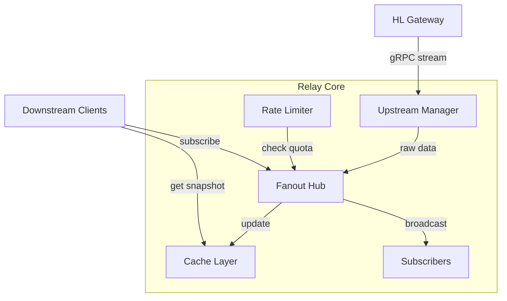
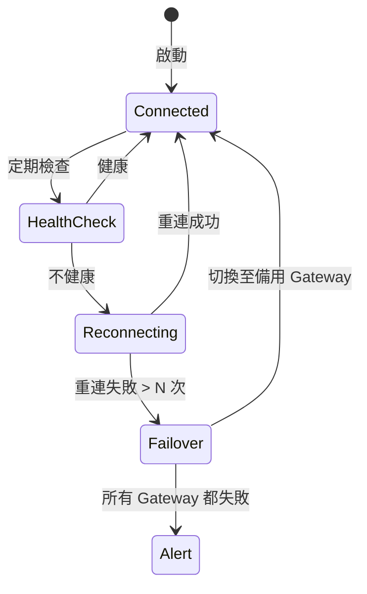

# Relay Core 設計文件

> 本文件為 [HL Relay Architecture](./hl-relay-architecture.md) 的子設計文件，
> 專注於 **Data Plane** 的詳細設計。

---

## 1. 概述

Relay Core 是 HL Relay Service 的核心資料處理引擎，負責：

1. 與上游 HL Gateway 建立並維護連線
2. 接收並處理市場資料
3. 快取最新狀態
4. 分發資料給下游訂閱者
5. 執行限流策略

---

## 2. 模組架構圖



---

## 3. Upstream Manager 詳細設計

### 3.1 職責

* 管理與 HL Gateway 的 gRPC/WebSocket 長連線
* 維護每個 symbol 的上游 stream 生命週期
* 實現自動重連與 failover 機制

### 3.2 資料結構（概念）

```
UpstreamManager {
    gateways: []GatewayConfig          // 可用的 Gateway 列表（主/備）
    activeGateway: *GatewayConnection  // 當前連線的 Gateway
    streams: map[symbol]UpstreamStream // symbol -> stream 對應
    healthChecker: HealthChecker       // 健康檢查元件
}

GatewayConfig {
    endpoint: string     // gRPC endpoint
    priority: int        // 優先順序（越小越優先）
    region: string       // 所屬區域
}

UpstreamStream {
    symbol: string
    status: StreamStatus // CONNECTING, ACTIVE, RECONNECTING, CLOSED
    lastUpdate: time     // 最後收到資料時間
    reconnectCount: int  // 重連次數
}
```

### 3.3 重連策略

採用 **Exponential Backoff with Jitter**：

| 重試次數 | 基礎延遲 | 最大延遲 | Jitter |
|----------|----------|----------|--------|
| 1 | 100ms | 100ms | ±10% |
| 2 | 200ms | 200ms | ±10% |
| 3 | 400ms | 400ms | ±10% |
| 4 | 800ms | 800ms | ±10% |
| 5+ | 1600ms | 30s | ±10% |

### 3.4 Failover 流程



### 3.5 健康檢查

* **Ping 檢查**：每 5 秒送 ping，期望 1 秒內回應
* **資料流檢查**：若 30 秒內無任何資料，視為異常
* **錯誤率檢查**：滑動窗口 1 分鐘內錯誤率 > 5% 則不健康

---

## 4. Fanout Hub 詳細設計

### 4.1 職責

* 管理 symbol → subscribers 的映射
* 將上游資料廣播給所有訂閱者
* 處理 slow consumer 問題

### 4.2 資料結構（概念）

```
FanoutHub {
    topics: map[symbol]*Topic
    mutex: sync.RWMutex
}

Topic {
    symbol: string
    subscribers: map[subscriberID]*Subscriber
    lastUpdate: time
    mutex: sync.RWMutex
}

Subscriber {
    id: string
    tenantID: string
    apiKey: string
    sendChan: chan Message     // 發送 buffer
    connectTime: time
    lastSendTime: time
    droppedCount: int          // 被丟棄的訊息數
}
```

### 4.3 發送模型

採用 **非阻塞發送 + Buffer**：

1. 每個 subscriber 有獨立的 send buffer（建議 100-1000 條）
2. 發送時使用 `select` + `default` 實現非阻塞
3. 若 buffer 滿，則丟棄該筆更新並記錄

```
發送邏輯（概念）：
select {
case subscriber.sendChan <- message:
    // 成功發送
default:
    // buffer 滿，記錄並丟棄
    subscriber.droppedCount++
    metrics.increment("fanout_dropped_messages")
}
```

### 4.4 Slow Consumer 處理

| 條件 | 處理方式 |
|------|----------|
| 連續丟棄 > 100 條 | 警告 log |
| 連續丟棄 > 1000 條 | 斷開連線 |
| 最後發送時間 > 60s | 視為 zombie，斷開連線 |

---

## 5. Cache Layer 詳細設計

### 5.1 職責

* 儲存每個 symbol 的最新 snapshot
* 支援快速查詢（新訂閱者初始化用）
* 可選：儲存最近 N 筆 trades 供間隙補齊（gap filling）

### 5.2 資料結構（概念）

```
CacheLayer {
    orderbooks: map[symbol]*OrderbookSnapshot
    trades: map[symbol]*TradeRingBuffer  // 可選，最近 N 筆
    mutex: sync.RWMutex
}

OrderbookSnapshot {
    symbol: string
    timestamp: time
    sequence: int64
    asks: []PriceLevel  // 賣單 (價格遞增)
    bids: []PriceLevel  // 買單 (價格遞減)
}

PriceLevel {
    price: decimal
    size: decimal
    orderCount: int  // 可選
}

TradeRingBuffer {
    trades: [N]Trade
    head: int
    tail: int
}
```

### 5.3 快取更新策略

* **Orderbook**：收到更新時，合併增量到現有 snapshot
* **Trades**：Ring buffer，保留最近 1000 筆
* **記憶體控制**：定期清理無訂閱的 symbol 快取

### 5.4 一致性考量

* 使用 sequence number 確保不遺漏
* 若偵測到 gap，觸發完整 snapshot 重建

---

## 6. Rate Limiter 詳細設計

### 6.1 職責

* 根據 API Key / Tenant 的 plan 執行限流
* 防止資源濫用

### 6.2 限流維度

| 維度 | 說明 | 預設值（可配置） |
|------|------|------------------|
| 最大併發訂閱數 | 單一 API Key 可同時訂閱的 stream 數 | Free: 5, Pro: 50, Enterprise: 500 |
| 每秒訂閱請求 | 每秒可發起的新訂閱/取消訂閱 | 10 req/s |
| 每秒 API 請求 | REST/gRPC call 頻率 | 100 req/s |

### 6.3 演算法選擇

採用 **Token Bucket** 演算法：

* 優點：允許短暫 burst，同時控制長期平均
* 實現：使用 Go 官方擴展套件 `golang.org/x/time/rate`（Go 1.16+）

```
TokenBucket（概念）：
- capacity: 桶容量（最大 burst）
- rate: 填充速率（tokens/sec）
- tokens: 當前 token 數

Allow():
    if tokens > 0:
        tokens--
        return true
    else:
        return false
```

### 6.4 限流回應

當限流觸發時：

* **gRPC**：回傳 `RESOURCE_EXHAUSTED` 狀態碼
* **HTTP**：回傳 `429 Too Many Requests`
* **WebSocket**：發送錯誤訊息並可選擇斷線

---

## 7. 效能考量

### 7.1 記憶體優化

* 使用 `sync.Pool` 減少 GC 壓力
* 預分配 buffer 避免頻繁記憶體申請
* Orderbook 使用 slice 而非 map（price level 數量有限）

### 7.2 並發模型

* 每個 symbol 的 topic 使用獨立的 goroutine 處理
* 避免全域鎖，使用細粒度鎖或 lock-free 結構

### 7.3 延遲優化

* 使用 gRPC streaming 而非 polling
* 減少序列化/反序列化次數
* 考慮使用 zero-copy 技術

---

## 8. 錯誤處理

### 8.1 上游錯誤

| 錯誤類型 | 處理方式 |
|----------|----------|
| 連線中斷 | 自動重連，使用 backoff |
| 解析錯誤 | 記錄並跳過該筆資料 |
| Gateway 不可用 | Failover 至備用 |

### 8.2 下游錯誤

| 錯誤類型 | 處理方式 |
|----------|----------|
| 發送失敗 | 記錄並嘗試重試 |
| Client 斷線 | 清理訂閱狀態 |
| Slow consumer | 丟棄訊息或斷線 |

---

## 9. 監控指標

### 9.1 關鍵 Metrics

```
# 上游
upstream_connection_status{gateway}     // 0=斷線, 1=連線中
upstream_reconnect_total{gateway}       // 重連次數
upstream_message_received_total{symbol} // 收到訊息數
upstream_latency_ms{gateway}            // 上游延遲

# Fanout
fanout_active_topics                    // 活躍 topic 數
fanout_active_subscribers               // 活躍訂閱者數
fanout_messages_sent_total{symbol}      // 發送訊息數
fanout_messages_dropped_total{symbol}   // 丟棄訊息數

# Cache
cache_snapshot_count                    // 快取 snapshot 數
cache_hit_total                         // 快取命中
cache_miss_total                        // 快取未命中

# Rate Limiter
ratelimit_allowed_total{tenant}         // 允許請求數
ratelimit_denied_total{tenant}          // 拒絕請求數
```

---

## 10. 配置項目

```yaml
relay_core:
  upstream:
    gateways:
      - endpoint: "gateway1.internal:50051"
        priority: 1
      - endpoint: "gateway2.internal:50051"
        priority: 2
    health_check_interval: 5s
    reconnect_max_delay: 30s
    
  fanout:
    subscriber_buffer_size: 500
    slow_consumer_threshold: 1000
    zombie_timeout: 60s
    
  cache:
    max_orderbook_depth: 100
    trade_history_size: 1000
    cleanup_interval: 5m
    
  rate_limiter:
    default_rps: 100
    default_max_streams: 10
    burst_multiplier: 2
```

---

## 附錄：相關文件

* [主架構文件](./hl-relay-architecture.md)
* [Control Plane 設計文件](./control-plane-design.md)
